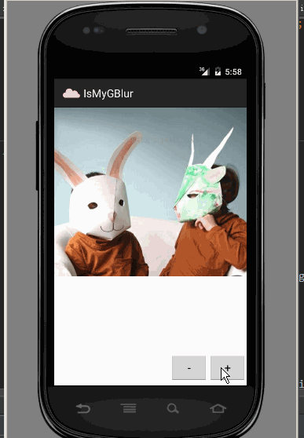

### 利用RenderScript实现了一个简单的ImageView的高斯模糊切换动画

- 传入的图片针对ImageView的大小进行过尺寸压缩处理以适应ImageView
- 在将图片进行高斯模糊处理前尺寸缩小3倍，模糊后再放大三倍，这样模糊处理时间段，占用内存稍微少一点
- 需要传入ImageView控件和新加载的图片的Bitmap对象
- 简单地对Bitmap进行了占用内存的优化处理
- 模糊程度可以自己后期实现来改变

### 效果图：

 